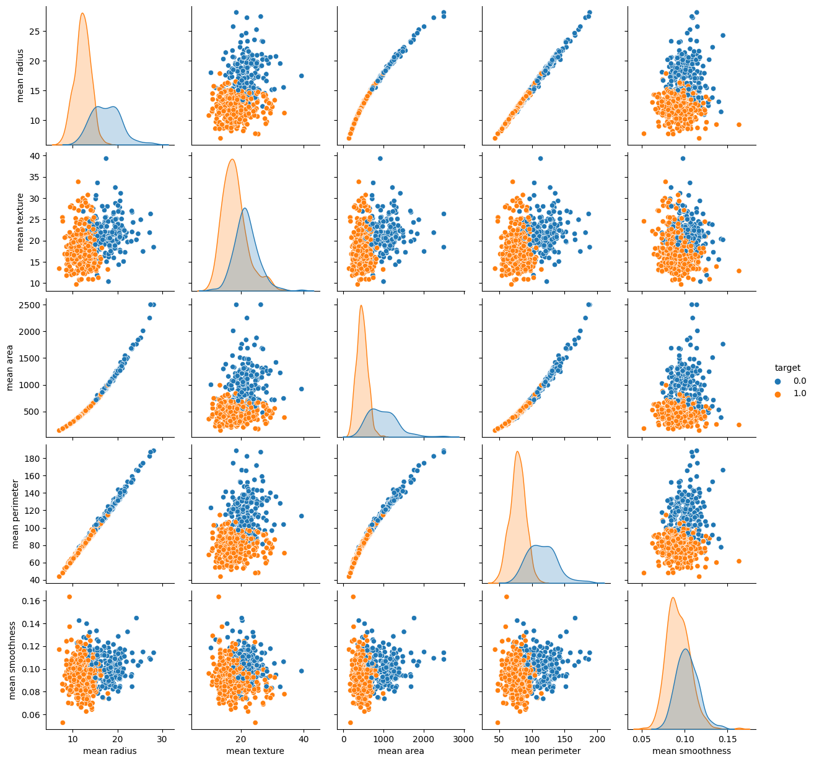
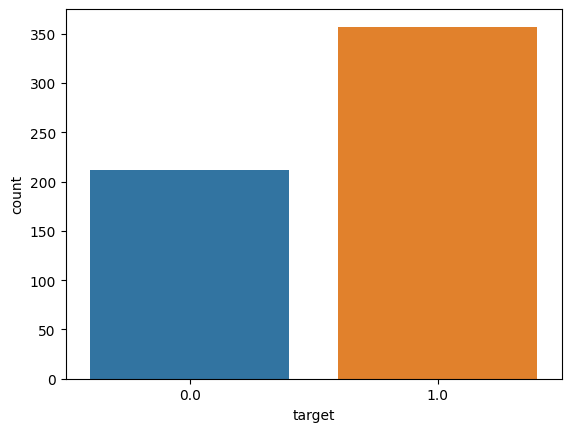
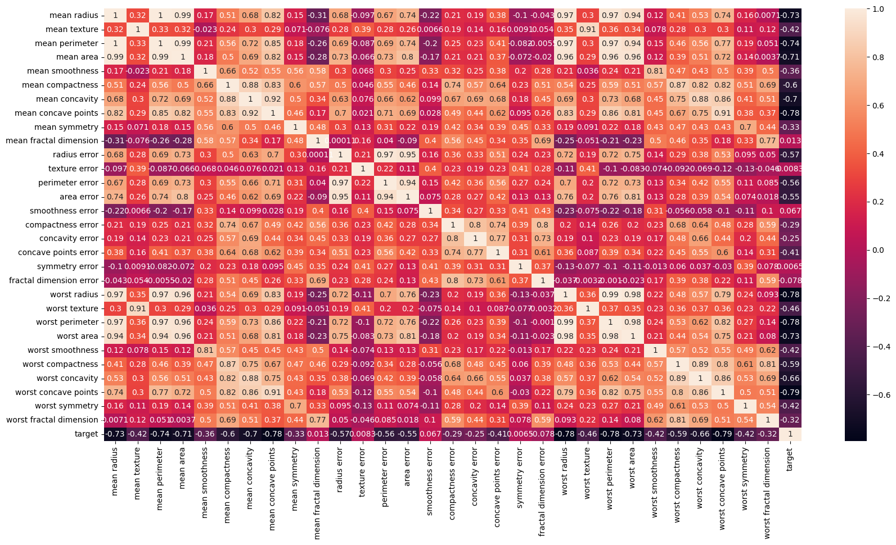
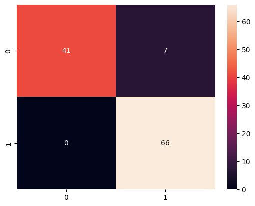
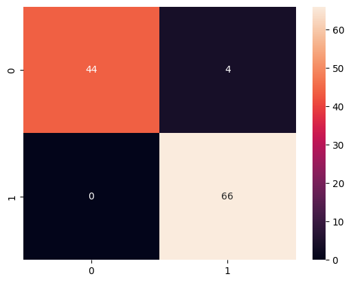

# Breast cancer classification

Breast cancer classification using machine learning techniques has become an essential area of research for improving early detection and diagnosis. This project focuses on developing a reliable model that can accurately differentiate between malignant and benign breast tumors.

In this breast cancer classification project, a Support Vector Machine (SVM) algorithm was employed to develop an accurate model for distinguishing between malignant and benign breast tumors.

The dataset used comprises 569 cases, with 212 cases labeled as malignant and 357 cases labeled as benign. The dataset consists of 30 features, including mean radius, mean texture, mean perimeter, mean area, mean smoothness, mean compactness, mean concavity, and mean concave points, among others. 

## Explotory data analysis
<table border="1" class="dataframe">
  <thead>
    <tr style="text-align: right;">
      <th></th>
      <th>mean radius</th>
      <th>mean texture</th>
      <th>mean perimeter</th>
      <th>mean area</th>
      <th>mean smoothness</th>
      <th>mean compactness</th>
      <th>mean concavity</th>
      <th>mean concave points</th>
      <th>mean symmetry</th>
      <th>mean fractal dimension</th>
      <th>...</th>
      <th>worst texture</th>
      <th>worst perimeter</th>
      <th>worst area</th>
      <th>worst smoothness</th>
      <th>worst compactness</th>
      <th>worst concavity</th>
      <th>worst concave points</th>
      <th>worst symmetry</th>
      <th>worst fractal dimension</th>
      <th>target</th>
    </tr>
  </thead>
  <tbody>
    <tr>
      <th>0</th>
      <td>17.99</td>
      <td>10.38</td>
      <td>122.80</td>
      <td>1001.0</td>
      <td>0.11840</td>
      <td>0.27760</td>
      <td>0.3001</td>
      <td>0.14710</td>
      <td>0.2419</td>
      <td>0.07871</td>
      <td>...</td>
      <td>17.33</td>
      <td>184.60</td>
      <td>2019.0</td>
      <td>0.1622</td>
      <td>0.6656</td>
      <td>0.7119</td>
      <td>0.2654</td>
      <td>0.4601</td>
      <td>0.11890</td>
      <td>0.0</td>
    </tr>
    <tr>
      <th>1</th>
      <td>20.57</td>
      <td>17.77</td>
      <td>132.90</td>
      <td>1326.0</td>
      <td>0.08474</td>
      <td>0.07864</td>
      <td>0.0869</td>
      <td>0.07017</td>
      <td>0.1812</td>
      <td>0.05667</td>
      <td>...</td>
      <td>23.41</td>
      <td>158.80</td>
      <td>1956.0</td>
      <td>0.1238</td>
      <td>0.1866</td>
      <td>0.2416</td>
      <td>0.1860</td>
      <td>0.2750</td>
      <td>0.08902</td>
      <td>0.0</td>
    </tr>
    <tr>
      <th>2</th>
      <td>19.69</td>
      <td>21.25</td>
      <td>130.00</td>
      <td>1203.0</td>
      <td>0.10960</td>
      <td>0.15990</td>
      <td>0.1974</td>
      <td>0.12790</td>
      <td>0.2069</td>
      <td>0.05999</td>
      <td>...</td>
      <td>25.53</td>
      <td>152.50</td>
      <td>1709.0</td>
      <td>0.1444</td>
      <td>0.4245</td>
      <td>0.4504</td>
      <td>0.2430</td>
      <td>0.3613</td>
      <td>0.08758</td>
      <td>0.0</td>
    </tr>
    <tr>
      <th>3</th>
      <td>11.42</td>
      <td>20.38</td>
      <td>77.58</td>
      <td>386.1</td>
      <td>0.14250</td>
      <td>0.28390</td>
      <td>0.2414</td>
      <td>0.10520</td>
      <td>0.2597</td>
      <td>0.09744</td>
      <td>...</td>
      <td>26.50</td>
      <td>98.87</td>
      <td>567.7</td>
      <td>0.2098</td>
      <td>0.8663</td>
      <td>0.6869</td>
      <td>0.2575</td>
      <td>0.6638</td>
      <td>0.17300</td>
      <td>0.0</td>
    </tr>
    <tr>
      <th>4</th>
      <td>20.29</td>
      <td>14.34</td>
      <td>135.10</td>
      <td>1297.0</td>
      <td>0.10030</td>
      <td>0.13280</td>
      <td>0.1980</td>
      <td>0.10430</td>
      <td>0.1809</td>
      <td>0.05883</td>
      <td>...</td>
      <td>16.67</td>
      <td>152.20</td>
      <td>1575.0</td>
      <td>0.1374</td>
      <td>0.2050</td>
      <td>0.4000</td>
      <td>0.1625</td>
      <td>0.2364</td>
      <td>0.07678</td>
      <td>0.0</td>
    </tr>
  </tbody>
</table>
<p>5 rows × 31 columns</p>
</div>

**Data Visualization**



0 - indicates Malignant --> The life threatning case

1 - indicates Benign

**Some observation :**
- Looking at the distributions for mean radius, mean area and mean perimeter. We see that Malignant cases tend to be larger than Benign.

- Looking at mean texture, we see that Melignant have a higher mean texture compared with Benign. 

- Benign have higher mean smoothness than Melignant


**Case count**

   

    
    
**Some observation**:
- More Benign cases than Malignent in the dataset.

**Correlation**




## Model Training

- Define Matrix of Features *X* and target *y*

- Split into testing and training data

- Fit the SVM model

```python
# Matrix of features X and target y
X = df.drop(["target"], axis = 1)
y = df["target"]


from sklearn.model_selection import train_test_split

X_train, X_test, y_train, y_test = train_test_split(X, y, test_size = 0.20, random_state=5)


from sklearn.svm import SVC
from sklearn.metrics import classification_report, confusion_matrix


model1 = SVC()

model1.fit(X_train, y_train)
```

## Model Evaluation

**Confusion Matrix**



**Looking at these results:**
- We have 0 type II errors. I.e, so the model did not give any False Negatives.
- 7 type I errors. The model gave 7 False Positive.
- When a cell was malignant, the model correcrly 41. And When the cell was benign, the model correcrlt identified 66.

## Improving Model

1. Feature scaling (Uniity Based Normalization).

2.  Grid Search. SVM parameters optimization: 
    - C parameter : Controll the trade of between classyfying and having a smooth decision bounary.
        - Small C (loose) : Makes cost of misclassification low (soft margin).
        - Large C (strict) : Makes cost of misclassification high, forcing model to explain input data stricter potentially over fitting.
    - Gamma parameter : Controls how far the influence of a single training set reaches.
        - Large Gamma : Close reach (closer data points have more weight)
        
        - Small Gamna : Far reach (more generalized solution)

**1. Results After Feature Scaling**




|              | precision | recall | f1-score | support |
|--------------|-----------|--------|----------|---------|
| 0.0          | 1.00      | 0.92   | 0.96     | 48      |
| 1.0          | 0.94      | 1.00   | 0.97     | 66      |
| accuracy     | 0.96      | 114    |          |         |
| macro avg    | 0.97      | 0.96   | 0.96     | 114     |
| weighted avg | 0.97      | 0.96   | 0.96     | 114     |

